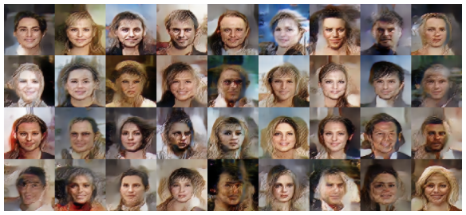

# Variational Autoencoder

Implementation of VAE using Pytorch

Original Paper on [VAE](https://arxiv.org/abs/1312.6114)

Nice [video](https://www.youtube.com/watch?v=9zKuYvjFFS8) explaining intuition behind it

Results below were achieved after training on these datasets:

 - [Real faces](https://www.kaggle.com/datasets/splcher/animefacedataset)
 - [Anime faces](https://www.kaggle.com/datasets/jessicali9530/celeba-dataset)


## VAE with discriminator 

In order to increase sharpness of images generated by plain VAE, model called discriminator was added at the end of generation process. So in this case VAE can be viewed as a generator in a GAN model, which will have to optimize reconstruction loss and so-called adversarial loss simultaneously.





## Plain VAE


## Training
To train on your dataset specify path to it in config.py ROOT_DIR variable

Also you can tweak all the hyperparameters except for IMG_SIZE must be power of 2 (32, 64, 128, etc.) and images in dataset supposed to have equal length and width

After you are all set just run

```
python train_vae.py 
```

or 

```
python train_vae_with_discriminator.py
```
in case you want sharper images to be generated after training

## Generating images with pretrained models

There are four available models to generate images

Script below has some parameters which can be viewed with specifying -h

Without any of them it will just generate anime face with plain VAE and put it in generated_images directory
```
python generate_image.py
```
